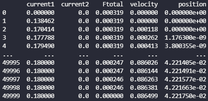
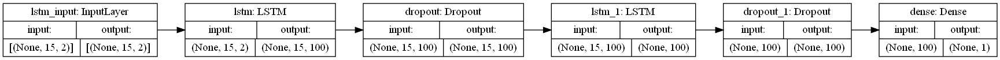
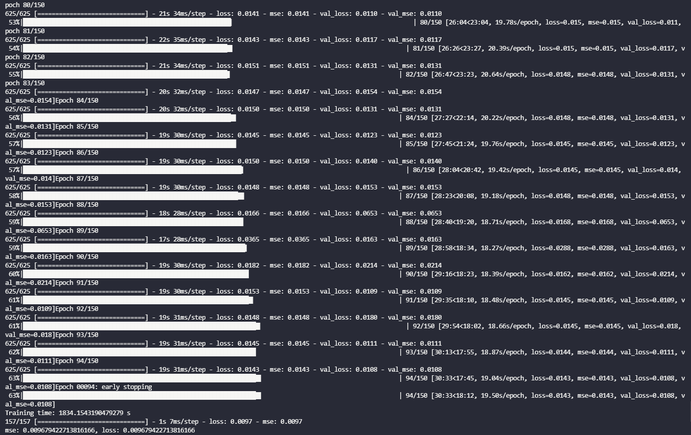
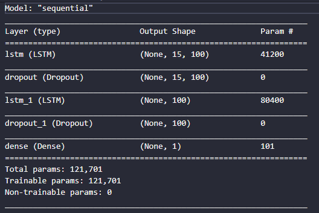
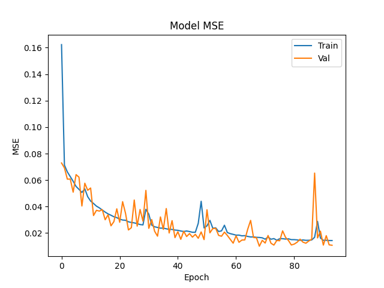
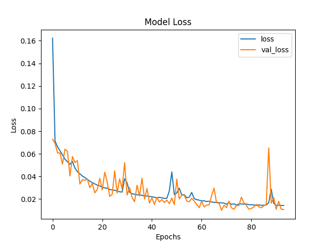
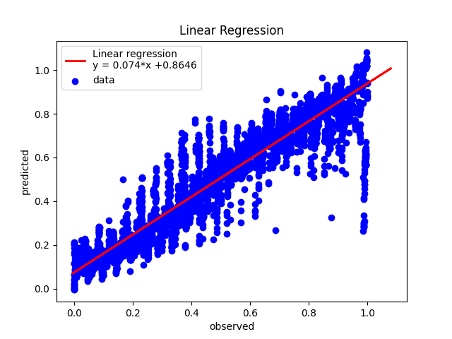
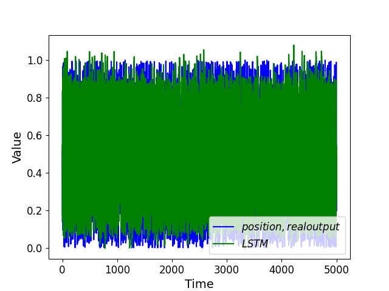
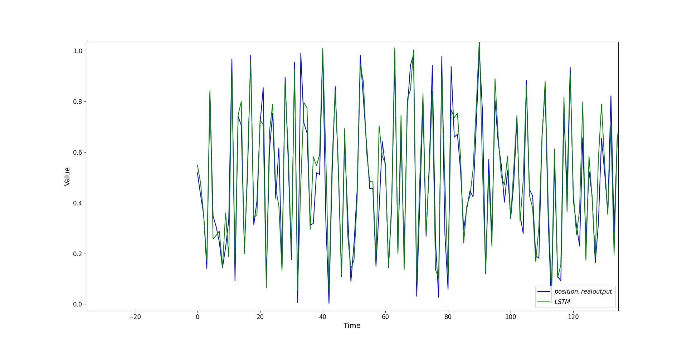

# LSTM Model( Long Short-Term Memory Model)
LSTMs have been a popular approach to all types of machine learning models because of their versatility. 
I’ve used them in sequence prediction tasks, natural language processing, and anomaly detection; 
others have found applications ranging from image processing to speech recognition. 
What sets it apart from a standard recurrent neural network is the presence of its cell memory unit, which helps to address the vanishing gradient problem.
We use LSTM for this work because we want to remember what has been happening previously in the control system.

# Import dataframe
The dataframe was saved before, and in this porject will be imported. (for more information, see the ./motion_profile folder)

The dataframe is as follow:



Now that we’ve seen what our data looks like, we want to convert it into arrays for our machine to process:
To convert our dataframe into an array, we just store the values of df (by accessing df.values) into the variable ‘dataset’.

We now split our dataset into input features (X) and the feature we wish to predict (Y). To do that split, we simply assign the first 3 columns of our array to a variable called X and the last two columns of our array to a variable called Y.

```
X = df[['Ftotal','velocity']].values
Y = df[['position']].values
```
Now, we are down to our last step in processing the data, which is to split our dataset into a training set, a validation set and a test set.
We will use the code from scikit-learn called ‘train_test_split’, which as the name suggests, split our dataset into a training set and a test set.

```
X_train, X_val_and_test, Y_train, Y_val_and_test = train_test_split(X_lstm, Y_lstm, test_size=0.2)
X_val, X_test, Y_val, Y_test = train_test_split(X_val_and_test, Y_val_and_test, test_size=0.5)
```
This tells scikit-learn that your val_and_test size will be 30% of the overall dataset. The code will store the split data into the first four variables on the left of the equal sign as the variable names suggest.

Unfortunately, this function only helps us split our dataset into two. Since we want a separate validation set and test set, we can use the same function to do the split again on val_and_test:

```
X_val, X_test, Y_val, Y_test = train_test_split(X_val_and_test, Y_val_and_test, test_size=0.5)
```
The code above will split the val_and_test size equally to the validation set and the test set.
After printing the shape of the arrays, we will get the following shapes.
```
(39988, 15, 2) (4998, 15, 2) (4999, 15, 2) (39988,) (4998,) (4999,)
```
As you can see, the training set has 39988 data points while the validation and test set has 4998 data points each. The X variables have 3 input features, while the Y variables only has 2 feature to predict.

# Build and Training Neural Network 
we want to have these layers:

```
model = Sequential()
if layers == 1:
    model.add(LSTM(units, input_shape=(X_train.shape[1], X_train.shape[2])))
    model.add(Dropout(drop))

else:
    model.add(LSTM(units, return_sequences=True, input_shape=(X_train.shape[1], X_train.shape[2])))
    model.add(Dropout(drop))

    for i in range(layers - 2):
        model.add(LSTM(units, return_sequences=True))
        model.add(Dropout(drop))
    
    model.add(LSTM(units))
    model.add(Dropout(drop))

model.add(Dense(1))

model.compile(loss=tf.keras.losses.MeanSquaredError(), 
        optimizer =RMSprop(learning_rate=initial_learning_rate), 
        metrics=['mse'])

es = EarlyStopping(monitor='val_loss',mode='min', verbose=1, patience=25)

start = time.time()
model_info = model.fit(X_train, Y_train, batch_size=100, epochs=epochs, validation_data=(X_val, Y_val), 
                callbacks=[es,TqdmCallback(verbose=1)])
```
After constructing the LSTM and Dropout layers, we have a Dense layer with a value of 1, 
since the model is only predicting 1 output value. We use the rmsprop optimizer and mean_squared_error as the loss function.
I like to set aside some of the training data for validation with the EarlyStopping(). 
This allows me to monitor the loss on validation data and stop the model training early if my loss plateaus 
(you can adjust how long you wait after it plateaus with the patience argument), 
which prevents overfitting the model. The TqdmCallback is a handy progress bar that 
I like better than the default one that comes with Keras. Finally, it’s always good to plot 
the loss function to make sure that both the training loss and validation loss show a 
general decreasing trend. It will take a bit of time to train the LSTM, but we’re not working with huge datasets, so it’s not prohibitive.
The function is called ‘fit’ as we are fitting the parameters to the data. We have to specify what data we are training on, which is X_train and Y_train. Then, we specify the size of batch_size and how long we want to train it for (epochs). Lastly, we specify what our validation data is so that the model will tell us how we are doing on the validation data at each point.




# Exponential decay
A popular learning rate schedule is to drop the learning rate at an exponential rate. Formally, it is defined as:
```
learning_rate = initial_lr * e^(−k * epoch)
```
Where initial_lr is the initial learning rate such as 0.01, k is a hyperparameter, and epoch is the current epoch number. Similarly, we can implement this by defining an exponential decay function lr_exp_decay() and pass it to LearningRateScheduler callback.




Here is the summary of our model.



```
Training time: 1834.1543190479279 s
```

After training we can evaluate it on the test set. 
```
loss, mse = model.evaluate(X_test, Y_test)

mse: 0.009679422713816166, loss: 0.009679422713816166
```


# Visualization 






# Linear Regression

In machine learning and statistics, Linear Regression is categorized as a supervised learning method and aims to model the linear relationship between a variable such as Y and at least one independent variable as X. In the Linear Regression, the linear relationships will be modeled by a predictor function in which its parameters will be estimated by the data and is called a Linear Model. The main advantage of the Linear Regression algorithm is its simplicity.

Linear Regression belongs to the general category of regression analysis which embraces different kinds of algorithms such as Linear Regression, Logistic Regression, Ridge Regression, and Lasso Regression, to name a few. In general, regression analysis is a kind of predictive modeling method that examines the relationship between a dependent (target) and some independent variables (exploratory).

print the linear regression and display datapoints



print statistical figure of merit
```
print("Mean squared error (MSE):       %f" % sklearn.metrics.mean_squared_error(Y_test,y_pred))
```

```
Mean squared error (MSE):       0.000132
```

# evaluate the prediction with real output
Here, you can see the prediction output is tracking the real output



If I zoom the figure, the results are well-shown.

