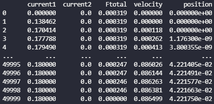
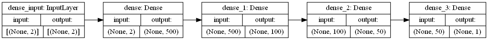
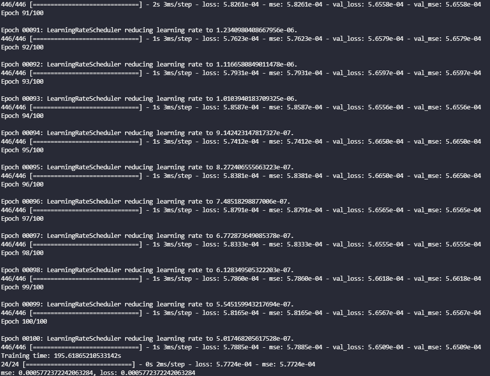
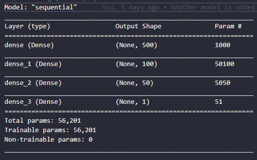
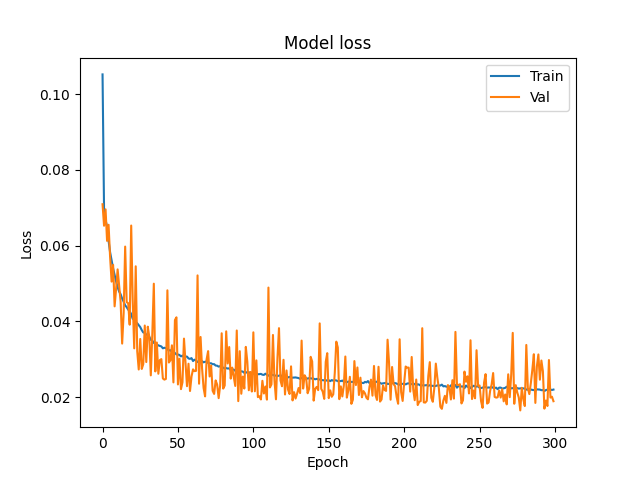
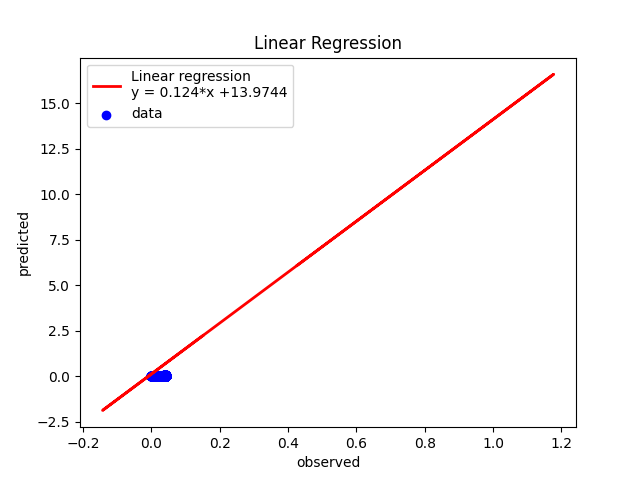
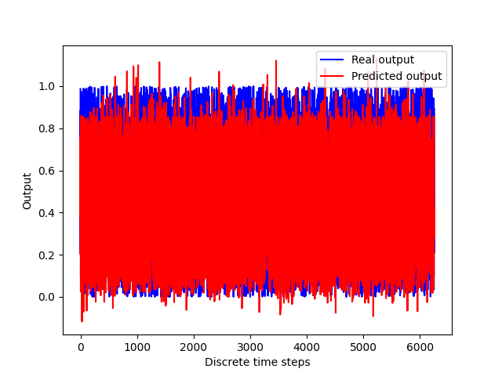
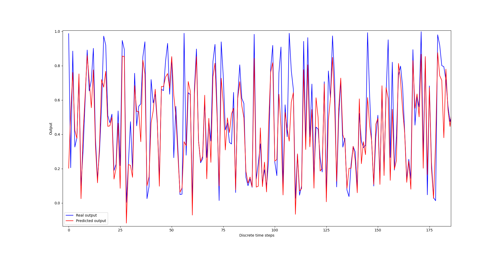

# Import dataframe
The dataframe was saved before, and in this porject will be imported. (for more information, please see, the ./motion_profile folder)
The dataframe is as follow:



Now that we’ve seen what our data looks like, we want to convert it into arrays for our machine to process:
To convert our dataframe into an array, we just store the values of df (by accessing df.values) into the variable ‘dataset’.

We now split our dataset into input features (X) and the feature we wish to predict (Y). To do that split, we simply assign the first 3 columns of our array to a variable called X and the last two columns of our array to a variable called Y.

```
X = X_scale[:,2:3]
Y = X_scale[:,4]
```
Now, we are down to our last step in processing the data, which is to split our dataset into a training set, a validation set and a test set.
We will use the code from scikit-learn called ‘train_test_split’, which as the name suggests, split our dataset into a training set and a test set.

```
X_train, X_val_and_test, Y_train, Y_val_and_test = train_test_split(X, Y, test_size=0.3)
```
This tells scikit-learn that your val_and_test size will be 30% of the overall dataset. The code will store the split data into the first four variables on the left of the equal sign as the variable names suggest.

Unfortunately, this function only helps us split our dataset into two. Since we want a separate validation set and test set, we can use the same function to do the split again on val_and_test:

```
X_val, X_test, Y_val, Y_test = train_test_split(X_val_and_test, Y_val_and_test, test_size=0.5)
```
The code above will split the val_and_test size equally to the validation set and the test set.
After printing the shape of the arrays, we will get the following shapes.
```
(37500, 1) (6250, 1) (6250, 1) (37500,) (6250,) (6250,)
```
As you can see, the training set has 77000 data points while the validation and test set has 16500 data points each. The X variables have 3 input features, while the Y variables only has 2 feature to predict.

# Build and Training Neural Network
we want to have these layers:

Hidden layer 1: 500 neurons, ReLU activation
Hidden layer 2: 100 neurons, ReLU activation
Hidden layer 2: 50 neurons, ReLU activation
Output Layer: 1 neuron,

Now, we need to describe this architecture to Keras. We will be using the Sequential model, which means that we merely need to describe the layers above in sequence.
```
model = Sequential()
model.add(Dense(500, activation= "relu"))
model.add(Dense(100, activation= "relu"))
model.add(Dense(50, activation= "relu"))
model.add(Dense(1))
```


Before we start our training, we have to configure the model by

* Specifying the algorithm for optimization
* Specifying the loss function
* Specifying the metrics 
```
model.compile(loss="mean_squared_error", 
        optimizer =RMSprop(learning_rate=initial_learning_rate), 
        metrics=['mse'])
```
Training the data by the following code:
```
model_info = model.fit(X_train, Y_train, batch_size=64, epochs=epochs, validation_data=(X_val, Y_val), 
                callbacks=[LearningRateScheduler(lr_exp_decay, verbose=1)])
```
The function is called ‘fit’ as we are fitting the parameters to the data. We have to specify what data we are training on, which is X_train and Y_train. Then, we specify the size of batch_size and how long we want to train it for (epochs). Lastly, we specify what our validation data is so that the model will tell us how we are doing on the validation data at each point.

# Exponential decay
A popular learning rate schedule is to drop the learning rate at an exponential rate. Formally, it is defined as:
```
learning_rate = initial_lr * e^(−k * epoch)
```
Where initial_lr is the initial learning rate such as 0.01, k is a hyperparameter, and epoch is the current epoch number. Similarly, we can implement this by defining an exponential decay function lr_exp_decay() and pass it to LearningRateScheduler callback.




Here is the summary of our model.




After training we can evaluate it on the test set. 
```
loss, mse = model.evaluate(X_test, Y_test)
```


# Visualization 




<!-- # Linear Regression
print the linear regression and display datapoints

 -->

print statistical figure of merit
```
print("Mean squared error (MSE):       %f" % sklearn.metrics.mean_squared_error(Y_test,y_pred))
```

```
Mean squared error (MSE):       0.017822
```

# evaluate the prediction with real output
Here, you can see the prediction figure. The predicted output is tracking the real output.



If I zoom the figure, the results are well-shown.

