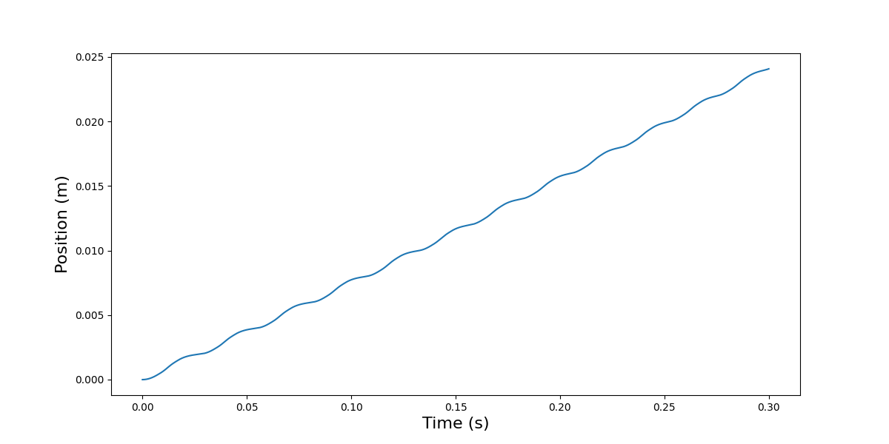
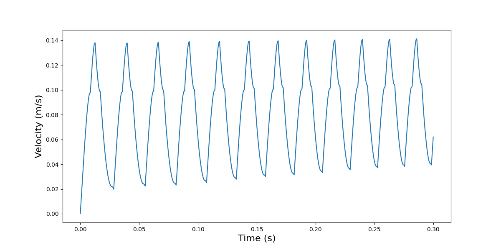
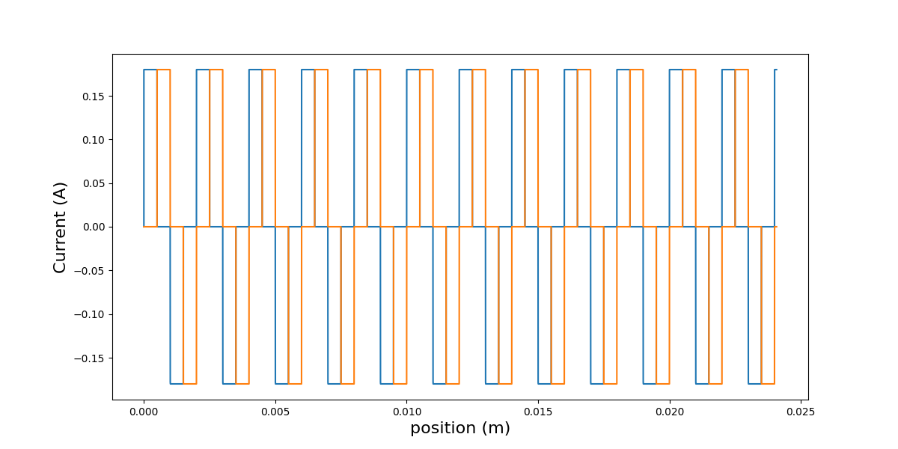

# Motion Profile

A micro-robot is acctuated by the current and voltage, and it is moving forward by applying current into a coplanar coil surface.
The equations for the movement of the micro-robot is follow frol the Newton's second law: 
```
𝑣 = 𝑑𝑠/ 𝑑𝑡
𝑎 = 𝑑𝑣/ 𝑑𝑡
𝐹 = 𝑓(x)
𝐹 = 𝑚𝑎
```
The equation for changing the current is in the following: 
```
𝐿𝑑𝑖/𝑑𝑡 = −𝑅𝑖 + 𝑢
```
The above mentioned equations are solved by Discretization method, and the Force which is generated by the current is generated by experimental data, and the model for the Force is approximated by sum of sine method in Matlab.
```
x1[i+1] = dt*x2[i] + x1[i]
curr1[i+1]= dt*(((-R/L)*curr1[i]) + v1*(1/L)) + curr1[i]
x2[i+1]= (dt*Ftotal[i]*(curr/0.1))/m + x2[i]
```
After running, the Results are as follow: 

## Position



## Velocity



## Force 


## Current



# DataFrame 
Finally, the generated data saved as a datafram for training purposes. (50000 data for training.)

